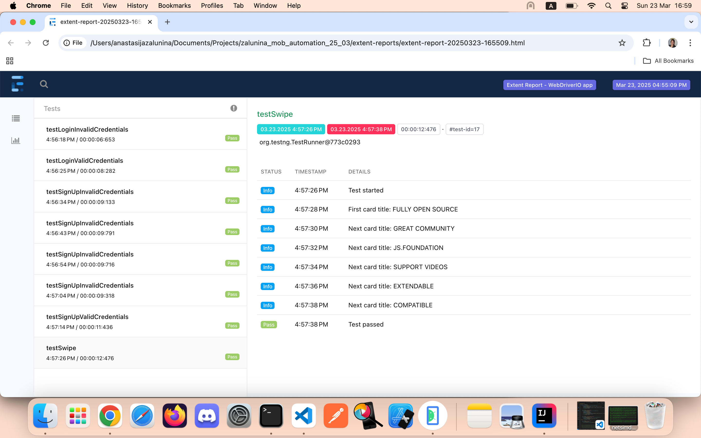
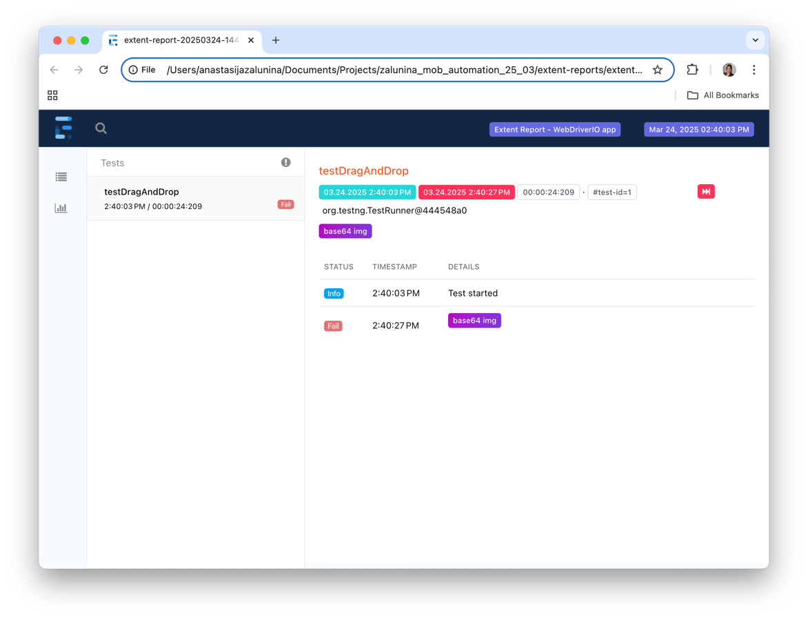

# WebDriverIOAppTest

## Running the tests

### To run all cases from the TestCases class:
```commandline
mvn clean test -Dsurefire.suiteXmlFiles=all-tests.xml
```
### To run cases by groups:
- the groups not to be executed can be commented out from the group-tests.xml
```commandline
mvn clean test -Dsurefire.suiteXmlFiles=group-tests.xml
```
### To run one case from the TestCases class:
```commandline
mvn clean test -Dsurefire.suiteXmlFiles=one-test.xml
```
### To run the parameter case from the TestCases class:
```commandline
mvn clean test -Dsurefire.suiteXmlFiles=parameter-test.xml
```
## Test reports
### To see the reports, open the .html file in /extent-reports
#### Test run results:

#### Example of a failed test:

